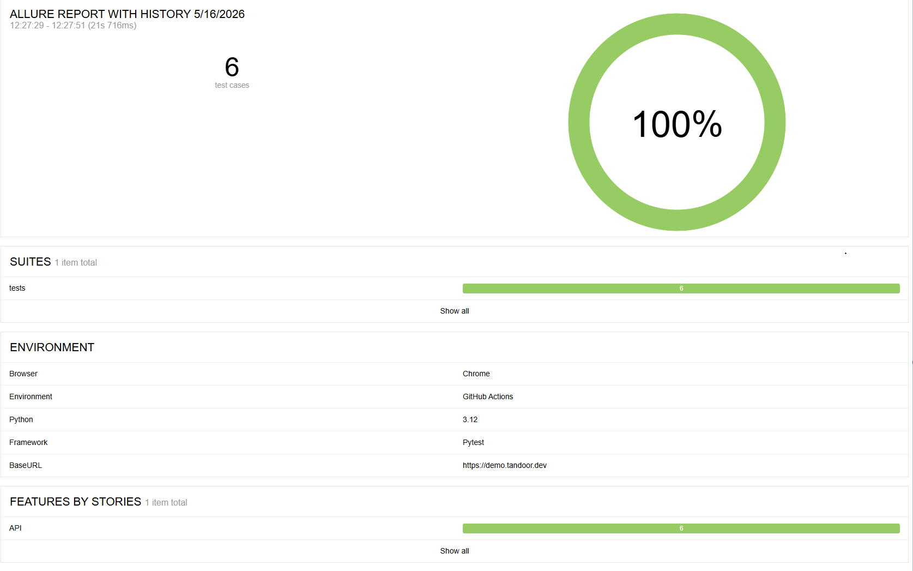

# QA_FinalProject_Maksimov


# QA Auto Tests for Tandoor Recipes

## Описание проекта

Проект содержит автоматизированные API- и UI-тесты для приложения Tandoor Recipes.

Основная цель проекта:

* проверка работы Meal Plan;
* проверка API рецептов;
* проверка авторизации пользователя;
* генерация Allure-отчётов;
* запуск тестов через GitHub Actions.

---

# Используемые технологии

* Python 3.12
* Pytest
* Selenium
* Requests
* Allure Report
* GitHub Actions
* Page Object Model (POM)
* dotenv
* webdriver-manager

---

# Требования для запуска

Перед запуском необходимо установить:

* Python 3.12+
* Google Chrome
* Git
* Allure CLI (для локального просмотра отчётов)

---

# Установка проекта

## 1. Клонировать репозиторий

```bash
git clone https://github.com/Vi0Ie/qa_auto_tandoor.git
cd qa_auto_tandoor
```

---

## 2. Создать виртуальное окружение

Windows:

```bash
python -m venv .venv
```

Активировать:

```bash
.venv\Scripts\activate
```

---

## 3. Установить зависимости

```bash
pip install -r requirements.txt
```

---

# Настройка переменных окружения

Создайте файл `.env` в корне проекта.

Пример:

```env
BASE_URL=https://demo.tandoor.dev
TANDOOR_USERNAME=your_username
TANDOOR_PASSWORD=your_password
TANDOOR_TOKEN=your_api_token
```

---

# Как получить API-токен

1. Войти в Tandoor Recipes
2. Открыть:
   Settings → API
3. Создать новый токен
4. Скопировать токен в `.env`

---

# Запуск тестов

## Все тесты

```bash
pytest
```

---

## Только UI-тесты

```bash
pytest tests/
```

---

## Только API-тесты

```bash
pytest api/
```

---

# Генерация Allure-отчёта

## Запуск тестов с Allure

```bash
pytest --alluredir=allure-results
```
## Allure Report Preview


---

## Открыть отчёт локально

```bash
allure serve allure-results
```

---

# GitHub Actions

Проект автоматически запускает тесты через GitHub Actions при каждом push в репозиторий.

После выполнения:

* запускаются API и UI тесты;
* создаётся Allure Report;
* отчёт публикуется через GitHub Pages.

---

# Allure Report

Ссылка на отчёт:

https://vi0le.github.io/qa_auto_tandoor/

---

# Структура проекта

```text
qa_auto_tandoor/
│
├── api/
│   └── client.py
│
├── components/
│   └── header_component.py
│
├── data/
│   └── recipe_links.json
│
├── pages/
│   ├── base_page.py
│   ├── login_page.py
│   ├── meal_plan_page.py
│   └── shopping_list_page.py
│
├── tests/
│   ├── create_and_delete_meal_plan.py
│   ├── login.py
│   ├── shopping_list_validation.py
│   ├── test_api_client.py
│   ├── test_recipes.py
│   └── view_meal_plan.py
│
├── screenshots/
├── .github/workflows/
├── conftest.py
├── requirements.txt
├── pytest.ini
└── README.md
```

---

# Архитектура проекта

Проект реализован с использованием паттерна Page Object Model (POM).

Каждая страница приложения вынесена в отдельный класс:

* LoginPage
* MealPlanPage
* BasePage

Это позволяет:

* переиспользовать код;
* упростить поддержку;
* уменьшить дублирование

---

# Реализованные тестовые сценарии

## UI

* Авторизация пользователя
* Создание Meal Plan
* Удаление Meal Plan
* Просмотр Meal Plan
* Проверка Shopping List

## API

* Получение рецептов
* Импорт рецепта
* Удаление рецепта
* Проверка API-клиента
* Проверка заголовков API

---

# Используемые библиотеки

* pytest
* selenium
* requests
* allure-pytest
* webdriver-manager
* python-dotenv

---

# Особенности, найденные во время тестирования

Во время тестирования была обнаружена проблема:

* при первом нажатии на день календаря диалоговое окно Meal Plan не открывается;
* компонент календаря перерисовывается;
* возникает проблема stale DOM elements при UI-автоматизации.

Issue был оформлен отдельно.


# Возможные улучшения

- негативные сценарии авторизации
- параметризация тестов
- проверка поиска рецептов
- параллельный запуск
- Docker
- Jenkins
---

# Автор

Максимов Антон
